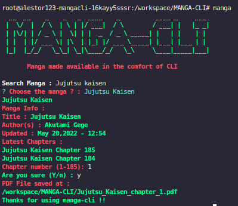
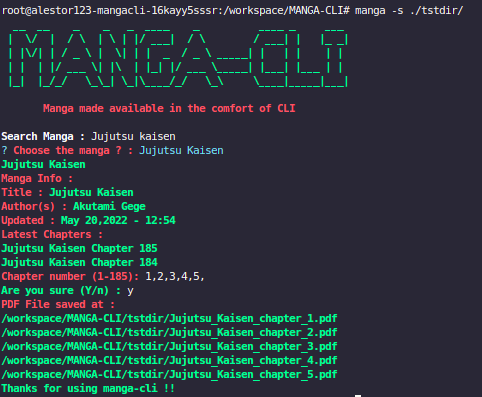
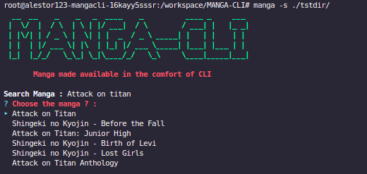

<h1 align=center>MANGA-CLI</h1>

> This is a simple code for fetching manga in the comfort of cli(for demo purpose)

<p align=center>

<a href="https://github.com/alestor123/MANGA-CLI/issues">
</a>

<a href="https://www.npmjs.com/package/manga-cli"></a>
</p>
<p align=center>
<a href="https://npmjs.org/package/manga-cli">
</a>
</p>

## 🚀 Usage

## API

```
const manga = require('./App');
(async () => {
  console.log(await manga('Jujutsu kaisen'))
})()

```

## Quick use
```
$ npx manga-cli -s <path>
```
## CLI Installation
```
$ npm install -g manga-cli
```
```
$ manga -s <path>
```

`` -s <path> `` is optional

# Fetch ALL the chapter
> use ``all`` command to fetch all chapters 
```
Chapter number : all
```

# EACCESS ERROR :
> If your facing eacess err while installing use this command :
```
$ npm install -g manga-cli --unsafe-perm=true --allow-root
```

# Screenshots    






## 💖 [Donate](https://alestor123.is-a.dev/donate)


## Author

👤 **Alestor Aldous**

- Twitter: [@alestor123](https://twitter.com/alestor123)
- Github: [@alestor123](https://github.com/alestor123)


## 📝 License
> MIT

Copyright © 2022 [Alestor Aldous](https://github.com/alestor123).<br />
